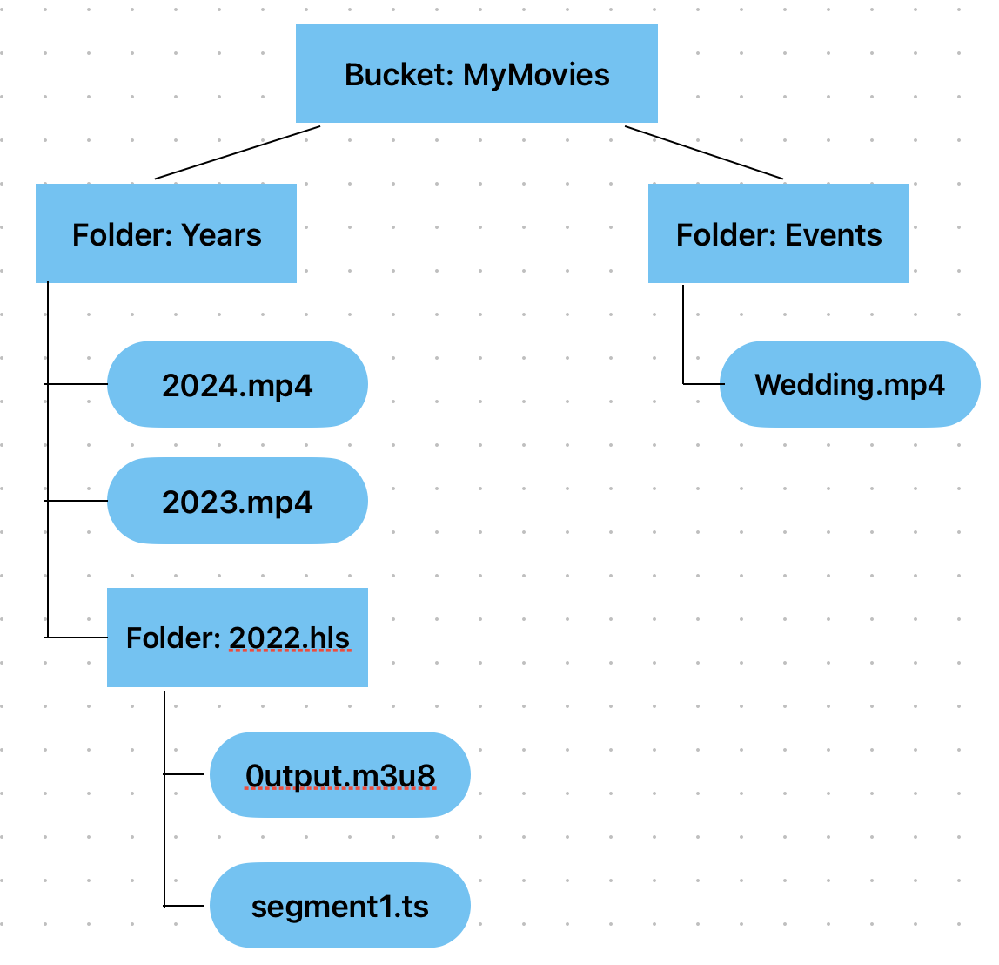

# flask-homemovies
Flask application to serve video files from OCI object storage in a secure web interface

# Usage
usage: 

    app.py [-h] [--instance_principal] [--resource_principal] [--secret SECRET] [--bucket BUCKET] [--os_endpoint OS_ENDPOINT] [--username USERNAME] [--password PASSWORD]

    options:
    -h, --help                show this help message and exit
    --instance_principal      Use Instance Principals for Authentication
    --resource_principal      Use Resource Principals for Authentication
    --secret SECRET           OCID of compartment with secrets vault
    --bucket BUCKET           Bucket Name
    --os_endpoint OS_ENDPOINT Object Storage Endpoint
    --username USERNAME       Username
    --password PASSWORD       Password

1. The object storage endpoint defaults to Ashburn, otherwise select an [endpoint from the list](https://docs.oracle.com/en-us/iaas/api/#/en/objectstorage/20160918/). 
1. Use instance principal auth for running on an OCI compute instance OR resource principal auth for running in an OCI container instance OR pass neither parameter which means we assume an OCI config file in ~/.oci
1. Bucket refers to the bucketname with foldered videos. 
1. Username and Password are the challenge credentials for the Flask app
1. Either bucket, username, and password need to be passed in or the secret flag must be passed with the OCID of a compartment that contains an OCI Secret Vault that holds those three secrets

# Preparing the local environment
1. cd python_app (enter the code working directory)
1. python3 -m venv ./.venv  (prepare the Python virtual environment)
1. source ./.venv/bin/activate (activate the virtual environment)
1. pip install -r requirements.txt (install all packages in virtual environment)
1. docker build -t flask-homemovies . (optionally build if you plan to run with docker)

# Running locally
1. Make sure you have an OCI config file at [~/.ici/config](https://docs.oracle.com/en-us/iaas/Content/API/SDKDocs/cliconfigure.htm).  
2. Most likely you will pass --bucket, --username, --password or alternatively can simply use --secret
3. Debugging can be done in VSCode, sample launch.json.template can be modified and renamed launch.json
4. To run locally with docker:  docker run --mount type=bind,source=$HOME/.oci,target=/root/.oci flask-homemovies --bucket $bname --username $uname --password $pwd

# Pushing to OCIR
1. docker login (login to remote OCIR registry)
1. docker tag flask-homemovies:latest $region_code.ocir.io/$os_namespace/hm/flask-homemovies (tag local image for push)
2. docker push $region_code.ocir.io/$os_namespace/hm/flask-homemovies:latest (push image to OCIR)

# Running in OCI on compute instance
1. Make sure dynamic groups and policies have been defined
1. docker run flask-homemovies --bucket $bname --username $uname --password $pwd --instance_principal (run in docker with instance principal permissions)

# Object Storage Configuration

All of the movies are served from OCI object storage.  Structuring the bucket following conventions described here is critical to the code functioning properly.

1. The bucket should have 1 level of directories which will serve the top level navigation.  There can be only one level of navigation.
1. Individual files should be put in these buckets with the appropriate extensions (e.g. .mp4, .avi, .mov)
1. For streaming 4K using adaptive bitrate you will need to generate an HLS directory consisting of a playlist (output.m3u8) and multiple segment files (output000.ts, output001.ts, etc).
1. An HLS directory must be uploaded to object storage into an object storage folder and the title of the folder must end with .hls
1. The HLS playlist file must be named output.m3u8.  Although segments can be named something else since they are referenced in the playlist, it is recommended to follow the HLS generation sample command below.

Here is a sample of what this might look like:

# HLS Directory Generation

Converting a 4K mp4 to HLS can be accomplished using the [FFMPEG](https://ffmpeg.org) tool.  Here is a sample command used to generate the HLS output:

    ffmpeg -i input.mp4 \
        -vf "scale=-2:2160" \  # Video filter to scale the video to a height of 2160 pixels (4K resolution)
        -c:v libx264 \          # Video codec to encode the video using H.264 codec
        -x264opts "keyint=24:min-keyint=24:no-scenecut" \  # Options for the x264 encoder
        -b:v 8000k \            # Target video bitrate (8 Mbps)
        -maxrate 10000k \       # Maximum video bitrate (10 Mbps)
        -bufsize 20000k \       # Buffer size for the video bitrate control
        -c:a aac \              # Audio codec to encode the audio using AAC codec
        -ac 2 \                 # Set the number of audio channels to stereo
        -b:a 128k \             # Target audio bitrate (128 kbps)
        -hls_time 4 \           # Duration of each HLS segment (4 seconds)
        -hls_playlist_type vod \# HLS playlist type (Video On Demand)
        output.m3u8             # Output HLS playlist file

# Uploading HLS Directory to Object Storage

An HLS directory may contain thousands of files.  The easiest way to upload it and map it to the proper folder (prefix) is to use the OCI CLI's bulk-upload command.

For example, if we follow the example above and assume the object storage namespace is 'MyNamespace' the command would look like this:

    oci os object bulk-upload -ns MyNamespace -bn MyMovies --src-dir . --prefix "2022.hls/"

You will need to replace MyNamespace, MyMovies, and the directory name (2022.hls) with your own values.  Make sure the folder is already created inside OCI and you are running this command from the folder with the playlist and segments.
