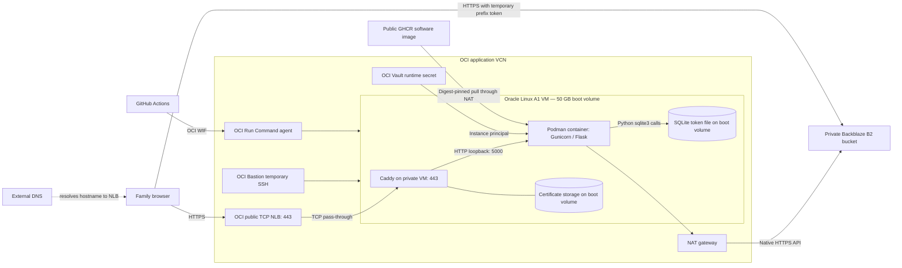
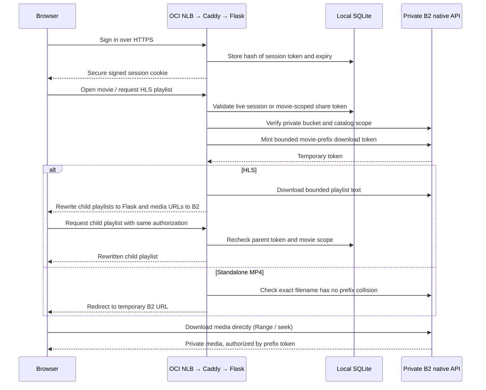
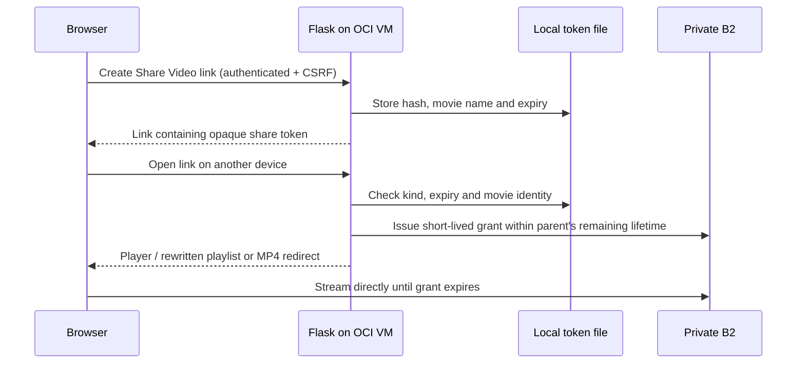
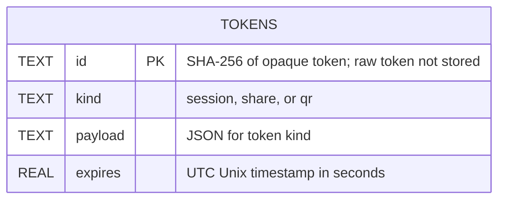

# Home Movies

Private family movie playback using Flask, native Backblaze B2 storage and one
OCI A1 VM. HLS playlists pass through authenticated Flask routes; media bytes
stream directly from the private B2 bucket. Standalone MP4 playback uses an
authenticated redirect to a short-lived native B2 download URL.

## Deployment architecture

- Private Oracle Linux 9 A1 VM: 1 OCPU, 2 GB RAM and a 50 GB boot volume;
  IMDSv1 disabled and no public VM address.
- Dedicated VCN with a private app subnet, public NLB subnet and NAT gateway.
  The TCP NLB forwards ports 80/443 to Caddy; its health check uses port 8080.
- Host Caddy manages Let's Encrypt HTTPS and stores certificates on the boot
  volume. Podman runs the ARM64 Gunicorn/Flask image on loopback port 5000.
- OCI Vault stores the named runtime JSON secret. SQLite contains disposable
  login, QR and sharing tokens with expiry checks and cleanup; no backup is needed.
- OCI Bastion supplies temporary SSH access. GitHub deploys immutable GHCR
  image digests through OCI Run Command, without SSH credentials.

### Where each component runs


```mermaid
flowchart LR
    Viewer[Family browser] -->|HTTPS| NLB[OCI public TCP NLB: 443]
    subgraph OCI[OCI application VCN]
        NLB -->|TCP pass-through| Caddy[Caddy on private VM: 443]
        subgraph VM[Oracle Linux A1 VM — 50 GB boot volume]
            Caddy -->|HTTP loopback: 5000| App[Podman container: Gunicorn / Flask]
            App -->|Python sqlite3 calls| DB[(SQLite token file on boot volume)]
            Caddy --- Certs[(Certificate storage on boot volume)]
        end
        Vault[OCI Vault runtime secret] -->|Instance principal| App
        App --> NAT[NAT gateway]
        Bastion[OCI Bastion temporary SSH] --> VM
        RC[OCI Run Command agent] --> VM
    end
    NAT -->|Native HTTPS API| B2[Private Backblaze B2 bucket]
    Viewer -->|HTTPS with temporary prefix token| B2
    Actions[GitHub Actions] -->|OCI WIF| RC
    GHCR[Public GHCR software image] -->|Digest-pinned pull through NAT| App
    DNS[External DNS] -. resolves hostname to NLB .-> Viewer
```

The NLB forwards TCP without terminating TLS. **Caddy runs on the host**, outside
Podman, and terminates HTTPS. Cloud-init installs Podman from Oracle Linux packages
and Caddy from the Caddy COPR repository, writes `/etc/caddy/Caddyfile`, and enables
`caddy.service`. Caddy obtains and renews Let's Encrypt certificates itself; its
persistent data is under `/var/lib/caddy/.local/share/caddy` on the existing boot
volume. No additional block volume or certificate container is needed.

**Gunicorn and Flask run inside one ARM64 Podman container.** The host's
`home-movies.service` starts it using the digest saved in
`/etc/home-movies/image.env`. It publishes only `127.0.0.1:5000`. The deployment
helper pulls and records an approved digest, restarts the service, then checks
local health. Application startup fetches the current Vault JSON using the VM's
instance principal and authorizes a bucket-restricted, read-only B2 application
key. Settings are loaded on startup; restart the service after a Vault change.

**SQLite is embedded in Python**, using its `sqlite3` module inside the container.
There is no database daemon or separate SQLite installation on the host. Its file
`/var/lib/homemovies/tokens.sqlite` maps to host
`/var/lib/home-movies/tokens/tokens.sqlite`. A writable bind mount preserves tokens
when the otherwise read-only container is replaced or the VM reboots. This file
contains disposable authentication state, not movies or a movie catalog, and needs
no backup. Caddy, SQLite and the image cache all use the same 50 GB boot volume.

### OCI and B2 playback interactions


```mermaid
sequenceDiagram
    participant Browser
    participant Web as OCI NLB → Caddy → Flask
    participant DB as Local SQLite
    participant B2 as Private B2 native API
    Browser->>Web: Sign in over HTTPS
    Web->>DB: Store hash of session token and expiry
    Web-->>Browser: Secure signed session cookie
    Browser->>Web: Open movie / request HLS playlist
    Web->>DB: Validate live session or movie-scoped share token
    Web->>B2: Verify private bucket and catalog scope
    Web->>B2: Mint bounded movie-prefix download token
    B2-->>Web: Temporary token
    alt HLS
        Web->>B2: Download bounded playlist text
        Web-->>Browser: Rewrite child playlists to Flask and media URLs to B2
        Browser->>Web: Request child playlist with same authorization
        Web->>DB: Recheck parent token and movie scope
        Web-->>Browser: Rewritten child playlist
    else Standalone MP4
        Web->>B2: Check exact filename has no prefix collision
        Web-->>Browser: Redirect to temporary B2 URL
    end
    Browser->>B2: Download media directly (Range / seek)
    B2-->>Browser: Private media, authorized by prefix token
```

Flask reads small playlist text and authorizes playback; it does not proxy video
bytes. HLS grants cover exactly the movie directory, including its trailing slash.
MP4 grants use the complete filename as the B2 prefix. Because B2 grants match
prefixes rather than exact objects, do not create sidecars beginning with an
existing MP4 filename. The app checks for collisions before and after minting;
the [upload runbook](docs/manual-b2-upload.md) also checks the combined inventory.
A later upload cannot revoke an already-issued B2 token, so preserve this invariant.
B2 CORS permits the configured public origin and Range requests; CORS does not
replace authentication. Keep the bucket private.


```mermaid
sequenceDiagram
    participant Browser
    participant Flask as Flask on OCI VM
    participant SQLite as Local token file
    participant B2 as Private B2
    Browser->>Flask: Create Share Video link (authenticated + CSRF)
    Flask->>SQLite: Store hash, movie name and expiry
    Flask-->>Browser: Link containing opaque share token
    Browser->>Flask: Open link on another device
    Flask->>SQLite: Check kind, expiry and movie identity
    Flask->>B2: Issue short-lived grant within parent's remaining lifetime
    Flask-->>Browser: Player / rewritten playlist or MP4 redirect
    Browser->>B2: Stream directly until grant expires
```

Deleting a parent token immediately blocks new grants from Flask. An existing B2
grant expires independently; its lifetime is capped at two hours and bounded by
the parent's remaining lifetime with a safety margin. Signed B2 URLs and share
links are bearer credentials and should not appear in public logs or screenshots.

### SQLite schema and expiry


```mermaid
erDiagram
    TOKENS {
        TEXT id PK "SHA-256 of opaque token; raw token not stored"
        TEXT kind "session, share, or qr"
        TEXT payload "JSON for token kind"
        REAL expires "UTC Unix timestamp in seconds"
    }
```

There is one table, `tokens`, and an index `token_expiry` on `expires`.
Session payloads are empty JSON; shares identify one movie; QR records hold the
owner nonce and approval state. Every read requires the expected kind and
`expires > current_time`, so expiration is enforced even before cleanup runs.
Login sessions last two hours, shares last 48 hours and QR challenges last 15 minutes.
Cleanup runs on startup and every 60 seconds in a Flask background thread,
removing expired rows and incrementally reclaiming pages. QR approval/consumption
uses transactions and consumption deletes the token. The database has a 32 MiB
page-count cap and uses rollback journaling (`journal_mode=DELETE`). SQLite
recovers an interrupted transaction when reopening the file; never delete a live
journal file. If the disposable database is deliberately reset while the service
is stopped, stored sessions, shares and QR tokens become invalid.

### Restart behavior

`caddy.service` and `home-movies.service` are enabled at boot. The app waits for
`network-online.target`, starts from its cached digest without a registry pull,
reloads Vault settings and reconnects to B2. Systemd retries both services after failures without exhausting a startup-rate limit.
Podman replaces a stale named container before startup.
Certificates and SQLite state survive reboot on the boot volume; catalog/grant
caches are rebuilt in memory. Initial provisioning leaves the application service
inactive until a successful first deployment writes `image.env`.

See the [operator guide](docs/operators-guide.md) for boot checks, logs, bounded
retention and recovery, and [Bastion access](docs/vm-maintenance.md) for temporary
SSH instructions. External Vault/B2 outages can delay a successful start; the
operator guide explains retry behavior and checks both health and real playback.

Infrastructure and deployment use GitHub workload identity federation. Home Movies
has separate infrastructure/deployment identities and compartment-scoped IAM;
the existing identity domain's GitHub issuer trust is shared additively. Application
networking and resources remain separate from other projects. The owner-created
compartment name/OCID, DNS/contact values and resource identifiers are environment
variables, outside Git. Runtime B2/login secrets never pass through GitHub or
Terraform. See [infrastructure](infra/README.md), [configuration](docs/public-repository-configuration.md)
and [operations](docs/operators-guide.md).

The migration remains on `codex/oci-a1-b2-migration`; the existing source app and
default branch remain intact until final acceptance. Public DNS now reaches the
new VM for the synthetic pilot. Real-library copy/verification is in progress;
see [Checkpoint 9](docs/checkpoint-9-mp4-and-library-transfer.md).

## Movie layout and uploads

Preserve every filename and prefix, including capitalization, spaces and Unicode.
HLS collections end in `.hls/` and use `output.m3u8` as their entrypoint. Relative
child playlists and segments stay under that movie's prefix. Standalone `.mp4`
files are discovered separately; MP4 fragments inside HLS folders are excluded.
The library refreshes its B2 listing on requests after at most five minutes.

```text
Years in Review/
  Movies 2026.hls/
    output.m3u8
    output000.ts
    output001.ts
  Family Highlights 2026.mp4
```

Uploads run manually from the operator's computer, once or twice a year, using a
separate bucket-restricted key. Follow the [native B2 upload runbook](docs/manual-b2-upload.md).
Upload dependencies before the main playlist. Check the entire destination plus
candidate inventory for MP4 filename-prefix collisions before every upload.
B2's native grants match prefixes, so sidecars such as `Family Highlights 2026.mp4.notes` must
not be added. No CI upload workflow or catalog publishing step is required.

To encode a new HLS movie locally, keep the existing output layout:

```bash
MOVIE_DIR='Years in Review/Movies 2026.hls'
mkdir -p "$MOVIE_DIR"
ffmpeg -i 'Years in Review/Movies 2026.mp4' \
  -vf 'scale=-2:2160' -c:v libx264 \
  -x264opts 'keyint=24:min-keyint=24:no-scenecut' \
  -b:v 8000k -maxrate 10000k -bufsize 20000k \
  -c:a aac -ac 2 -b:a 128k \
  -hls_time 4 -hls_playlist_type vod \
  "$MOVIE_DIR/output.m3u8"
```

Encoding is separate from migration: do not transcode or rename source files as
part of the OCI-to-B2 copy. Browser compatibility depends on the media codecs;
test real movies on the family devices before final acceptance.

## Local development and tests

```bash
python3 -m venv .venv
source .venv/bin/activate
pip install -r scripts/requirements-test.txt
python -m coverage run -m unittest discover -s scripts -p 'test_*.py'
python -m coverage report
python scripts/check_public_files.py
```

Tests live in `scripts/test_*.py`. GitHub runs them on every push and PR without
cloud credentials; mocked B2/OCI clients cover authorization, expiry, repository
behavior and infrastructure. Coverage must exceed 90 percent. ARM64 release jobs
also test before publishing. Live service tests are separate and use private
ignored configuration; do not add real credentials to CI tests.

To run the app on your laptop, follow [local development](docs/local-development.md):
install dependencies, create an ignored owner-only configuration with a private B2
read-only key and local login, then run Flask or Gunicorn on `127.0.0.1:5055`.
The guide includes the local B2 CORS rule, optional folder filtering, browser checks,
coverage reports and cleanup. SQLite runs inside Python; OCI and Caddy are not
required locally. Production uses `HM_CONFIG_SECRET_OCID` to load settings from
OCI Vault using the VM's instance principal.

## GitHub Actions setup and releases

[GitHub Actions setup](docs/github-actions.md) describes the permanent workflows,
environment variables/secrets, workload identity federation, Terraform state,
release triggers and how to inspect failures. CI needs no cloud credentials;
infrastructure and deployment use separate OCI identities.

[Automation and cutover](docs/automation-and-cutover-plan.md) lists the implemented
workflows, environment configuration and remaining acceptance steps. Ordinary
infrastructure/release jobs use `homemovies-infrastructure` and
`homemovies-production`; reviewer approval gates are disabled by owner preference.
Temporary administrator bootstrap workflows remain disabled after setup.

Builds publish software-only ARM64 images to the public GHCR package. An immutable
digest from this project's repository is the only deployment input. Credentials,
private configuration and movies are excluded from the image. The public image
contains no private library. The source Container Instance/OCIR workflow is removed
on this branch so merging cannot trigger an old-source deployment.

For occasional host access and logs, follow [VM maintenance](docs/vm-maintenance.md).
Application settings come from Vault; restart/deploy reloads the secret. SQLite
loss requires viewers to sign in again and invalidates its stored shares/QR tokens.
