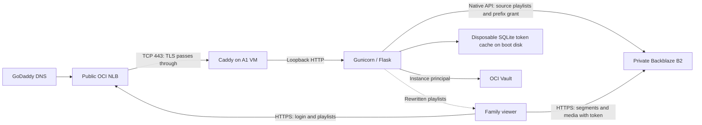

**Home Movies migration proposal — researched October 7, 2026**

Recommendation: a dedicated OCI A1 VM with 1 OCPU, initially 2GB RAM, and a 50GB boot volume; Caddy on the host; Flask behind Gunicorn in an ARM64 container; SQLite as a disposable authentication/authorization token cache replacing Redis; a public OCI Network Load Balancer (NLB); and a private Backblaze B2 bucket accessed through the native B2 API and Python `b2sdk`. Use one media-serving approach: Flask rewrites every HLS playlist with absolute B2 media URLs carrying a movie-prefix download token. Players fetch small playlists from Flask and all video bytes directly from B2. Keep GoDaddy DNS. Use HTTP-based ACME validation and let Caddy manage Let's Encrypt certificates. Use OCI Vault for runtime secrets. Kubernetes and a separate certificate volume are unnecessary.

The workload is occasional family viewing, usually one viewer and a few movies per month. This proposal prioritizes low recurring cost, straightforward recovery, and private media. It is an architecture proposal, not a deployed or tested implementation. Infrastructure bootstrap, application deploys, media migration, and DNS cutover are designed to run through GitHub Actions; Terraform manages the OCI infrastructure. Implementation is isolated on `codex/oci-a1-b2-migration` until the actual cutover is tested, then merged into the current default branch (`main`).

**What was examined.** The complete public repository was cloned into `flask-homemovies/` and inspected at commit [`b9dcf209ef031350cbc11afcdfa87b52ace325cc`](https://github.com/eshneken/flask-homemovies/tree/b9dcf209ef031350cbc11afcdfa87b52ace325cc), dated July 22, 2026. Inspection included Python routes, authentication and share state, templates, dependencies, Dockerfile, both deployment pipelines, certificate script, and README. Native B2 API/SDK documentation, HLS playlist semantics, and player integration were checked; ordinary relative-URL resolution was checked locally. No cloud account, live bucket inventory, or running service was accessed. Real bucket/player integration remains an implementation acceptance test.

**The paid tenancy makes the compute budget workable.** Oracle's general Always Free documentation now describes 2 A1 OCPUs/12GB. Its price list separately gives paid tenancies 3,000 A1 OCPU-hours and 18,000 GB-hours monthly. You confirmed the destination is Pay As You Go. Use that paid-tenancy allowance, and check actual billing/usage after deployment. [Oracle price list](https://www.oracle.com/cloud/price-list/)

| Resource | Other application | Home Movies proposal | Result |
|---|---:|---:|---|
| A1 CPU | 2 OCPUs | 1 OCPU | 3 total; 2,232 OCPU-hours in a 31-day month |
| A1 RAM | Not yet specified | 2GB initially | Combined memory must remain within the monthly allowance; 24GB continuously uses 17,856 GB-hours in 31 days |
| Boot/block storage | About 100GB | 50GB boot | 150GB if the 100GB includes all other boots; 200GB if it excludes one additional 50GB boot |
| Flexible application LB | One 10Mbps LB | None additional | Existing allocation remains sufficient for the other app |
| Network LB | Assumed unused | One public NLB | Verify it is available |
| Additional data volume | As required by other app | None | Caddy and SQLite use directories on the existing boot disk |

Oracle documents 200GB of combined boot/block storage, five combined volume backups, one free NLB, and one 10Mbps flexible LB. Provision in the home region. Count retained old boot disks during migration, not just attached disks. [Always Free resource limits](https://docs.oracle.com/en-us/iaas/Content/FreeTier/freetier_topic-Always_Free_Resources.htm)

Start with 1 OCPU rather than consuming the entire remaining 2 OCPUs. There is no transcoding workload here. Allocate more only if measurements justify it. RAM allocation is a starting estimate, not a measured requirement.

**Object storage choice.** Estimates below assume a steady 200 decimal GB of current objects, no accumulating old versions, and low monthly download volume. Taxes, extra backups, and optional products are excluded.

| Provider | Estimated monthly storage | Delivery cost at this workload | Assessment |
|---|---:|---|---|
| Backblaze B2 | **$1.32** | Included while total egress stays within roughly 600GB/month | Best fit among the compared options |
| Cloudflare R2 Standard | **$2.85** | No egress charge; request usage must stay within allowances | Good alternative if viewing rises substantially |
| Bunny Storage, one HDD region | **$2.00** | Public CDN distribution costs extra | Useful if you want integrated CDN delivery |
| Wasabi | **$7.99 minimum** | Subject to its egress policy | 1TB minimum and retention terms make it poor value at 200GB |

B2 currently advertises $6.95/TB per 30 days, first 10GB free, free ordinary API transactions, and egress equal to three times average stored data; excess egress is $0.01/GB. Calculation: `(200 - 10) × $0.00695 = $1.3205`. [B2 pricing](https://www.backblaze.com/cloud-storage/pricing)

R2 Standard calculation: `(200 - 10) × $0.015 = $2.85`. Its monthly allowances include 1 million Class A and 10 million Class B operations. Avoid Infrequent Access for active playback because retrieval charges apply. [R2 pricing](https://developers.cloudflare.com/r2/pricing/)

Bunny's single-region storage rate is $0.01/GB; North America/Europe standard CDN delivery is $0.01/GB, or volume delivery starts at $0.005/GB. [Storage pricing](https://bunny.net/pricing/storage/), [CDN pricing](https://bunny.net/pricing/)

Wasabi bills a minimum 1TB, currently $7.99 in North America/EMEA/APAC, with a 90-day minimum storage duration for Pay As You Go. [Wasabi pricing terms](https://wasabi.com/pricing/faq)

My calculations put B2/R2's approximate break-even around 750GB monthly downloads at this storage size, assuming included R2 operations. At about 8Mbps, a viewing hour transfers roughly 3.6GB. Several movies monthly are comfortably below that point. A four-second HLS segment cadence produces about 900 segment requests/hour. Set storage/download alerts; leaked share links can generate unexpected traffic.

Do not add a CDN initially. In particular, B2's free egress through Cloudflare partners does not establish that a free Cloudflare CDN plan permits externally hosted video. Cloudflare explicitly distinguishes video hosted in its own products from external video. [Cloudflare video policy](https://developers.cloudflare.com/fundamentals/reference/policies-compliances/delivering-videos-with-cloudflare/)

**Proposed request flow.**



The NLB forwards TCP 80 and 443; it cannot terminate TLS, redirect HTTP, or route HTTP hostnames itself. Caddy owns those functions. Traffic remains encrypted between viewer and Caddy through the NLB. [NLB capabilities](https://docs.oracle.com/en-us/iaas/Content/NetworkLoadBalancer/introduction.htm)

Use a reserved NLB public IP and a GoDaddy A record for the movie hostname. Only publish an AAAA record if the complete IPv6 path is configured and tested. A stale AAAA record can disrupt both viewing and certificate validation.

Put the VM in a private subnet, with outbound HTTPS through the VCN NAT gateway for B2, ACME, images, and updates. A service gateway can carry supported OCI service traffic, but cannot reach B2 or Let's Encrypt. Reuse the other application's VCN/gateways where appropriate while separating application NSGs. A private VM requires a working egress route; a public NLB supplies inbound traffic, not general outbound connectivity. [OCI NAT routing](https://docs.oracle.com/en-us/iaas/Content/Network/Tasks/NATgateway.htm)

For the initial NLB setup, use full NAT mode (source preservation disabled). Permit VM web ports only from the NLB, and permit a dedicated readiness port only from NLB health checks. This deliberately loses the client IP at the VM. Apply login throttling per account plus a global ceiling. If client-IP logging/rate limiting becomes necessary, configure source preservation and its security rules deliberately, or use supported PROXY protocol with a compatible receiver. Do not treat NLB source-preserved packets as though they originated from the NLB's private IP. [NLB operation modes](https://docs.oracle.com/en-us/iaas/Content/NetworkLoadBalancer/introduction.htm)

Bind Gunicorn to loopback only; expose no Flask, database, Docker API, Caddy admin, or SSH listener publicly. Use OCI Bastion for administration. Review security lists as well as NSGs: a permissive security-list rule is not overridden by a restrictive NSG. Keep the single backend's limitation explicit: an NLB does not make one VM highly available.

There are two valid simpler alternatives. A reserved public IP directly on the VM removes the NLB and NAT requirement; restrict public ingress to Caddy and manage the host through Bastion. Also, the existing flexible LB can technically serve a second hostname/backend: its allocation is shared bandwidth, not exclusive ownership by one app. Because video goes directly to B2, web-only traffic may fit comfortably. The dedicated NLB is preferable if you want independent ingress and certificate ownership.

**Certificates: use Caddy on the existing disk.** Caddy needs persistent certificate/account state, but persistence is not synonymous with an additional OCI block volume. Its default storage is a filesystem directory. For a host installation preserve its service data directory; for a container bind `/data` and `/config` to boot-disk directories. Certificate state for a few names is small; budget tens of MB, then measure. Protect and back up it as private-key material. [Caddy storage conventions](https://caddyserver.com/docs/conventions#data-directory)

Run Caddy as a supervised host service; run the app container behind it. This keeps certificate renewal running through application deployments. An illustrative configuration, with placeholder hostname/email, is:

```caddyfile
{
    email owner@example.com
    acme_ca https://acme-v02.api.letsencrypt.org/directory
}

movies.example.com {
    header Referrer-Policy "no-referrer"
    reverse_proxy 127.0.0.1:5000
}
```

HTTP-01 validation uses TCP 80; TLS-ALPN-01 uses TCP 443. Both pass through the corresponding NLB listeners. HTTP-01 is the straightforward choice for a named family-movies host. It needs no GoDaddy API credentials, no wildcard, and no DNS changes for each renewal. Test issuance against staging before production; verify certificate renewal/reload and persistence across restarts. [ACME challenges](https://letsencrypt.org/docs/challenge-types/), [Caddy HTTPS](https://caddyserver.com/docs/quick-starts/https)

**Native B2 changes the HLS recommendation.** Use prefix download grants instead of an S3 signature or an application redirect for each segment. The current `/movie` and `/shared` routes create bucket-wide OCI `AnyObjectRead` PARs, without an `object_name` restriction, then append the movie path. Replace that broad grant with one movie directory. [Current routes](https://github.com/eshneken/flask-homemovies/blob/b9dcf209ef031350cbc11afcdfa87b52ace325cc/python_app/service.py#L118)

B2's native `b2_get_download_authorization` accepts a bucket ID, filename prefix, and lifetime of 1 second through 7 days. One returned token authorizes download-by-name for all matching objects. It requires the server's `shareFiles` capability. An empty prefix provides bucket scope, but use `2022/Christmas.hls/` for this app. The final slash prevents matching adjacent names such as `Christmas.hls-backup/`. This is a lexical prefix, not a directory ACL. The token also covers subsequently added matching objects until expiry. [Native download authorization](https://www.backblaze.com/apidocs/b2-get-download-authorization)

Flask should receive a catalog movie ID, validate the session or share, map the ID to a trusted canonical prefix, and issue a grant. Never accept an arbitrary prefix from the browser. Choose a grant lifetime that covers the movie duration plus a reasonable pause allowance, capped by remaining playback/share authorization and the B2 maximum. Two hours is a starting value for shorter movies, not a universal limit. On an expired resume, reauthorize and load a freshly rewritten playlist; preserve the playback position where the player permits it. A short-lived playback credential is separate from the existing 48-hour share link.

The official Python SDK exposes this directly. This is illustrative server code; authorization checks and error handling are omitted:

```python
from urllib.parse import urlencode
from b2sdk.v3 import B2Api, InMemoryAccountInfo

# Initialize once per worker; retrieve these credentials from OCI Vault.
api = B2Api(InMemoryAccountInfo())
api.authorize_account(
    application_key_id=key_id,
    application_key=application_key,
    realm="production",
)
bucket = api.get_bucket_by_id(bucket_id)

# Only after validating the viewer and resolving a trusted catalog entry.
prefix = "2022/Christmas.hls/"
token = bucket.get_download_authorization(
    file_name_prefix=prefix,
    valid_duration_in_seconds=7200,
)
object_url = bucket.get_download_url(prefix + "output001.ts")
authorized_object_url = object_url + "?" + urlencode({"Authorization": token})
```

Use `get_download_url` to discover the download endpoint rather than hardcoding an `f000` host. Keep SDK account authorization in server memory; rewritten playlists contain only limited download tokens in media URLs. The adapter needs `catalog`, `read_manifest`, and `issue_movie_grant`; it needs no per-segment presigner. The snippet illustrates generating one media URL; production code must parse and rewrite the complete playlist. [Official SDK](https://github.com/Backblaze/b2-sdk-python), [SDK API initialization](https://b2-sdk-python.readthedocs.io/en/master/api/api.html), [Bucket methods](https://b2-sdk-python.readthedocs.io/en/master/api/bucket.html)

**A prefix grant solves authorization; HLS still needs token propagation.** Unlike a token embedded in an OCI PAR path, B2's browser download token goes in the `Authorization` query parameter. A playlist URL ending in `?Authorization=TOKEN` does not pass that query to a relative `output001.ts` reference. This was checked with ordinary URL resolution locally. An unchanged playlist and one authorized root URL therefore are insufficient.

**Use manifest rewriting for every player.** The only advantage of separate JavaScript request hooks was eliminating the small playlist requests to Flask. At occasional family usage, that saving does not justify two authorization paths, browser-specific selection, and a larger compatibility/test matrix. The recommended architecture now has one media-serving path and no B2-specific player request hook.

1. An authorized viewer obtains an expiring playback capability bound to one catalog movie and the authorization source. Store its hash, expiry, and movie association in SQLite. Use capability-bearing playlist URLs so a casting receiver can fetch them without the viewer's browser cookie.
2. On a playlist request, Flask validates the capability, loads a bounded-size source playlist from B2 or a bounded cache of unmodified source playlists, and obtains or reuses the playback's movie-prefix download grant. Generate fresh rewritten output for that playback; do not put personalized playlists into a shared cache.
3. Parse the playlist with an HLS-aware parser. Rewrite every segment, initialization file, subtitle/media reference, and applicable key URI to an absolute B2 download-by-name URL carrying the limited token. Rewrite child playlist references to absolute capability-bearing Flask URLs, then apply the same transformation when requested. Preserve timing, byte-range, encryption, and other supported playlist semantics. Reject external hosts, references outside the movie prefix, and unsupported URI-bearing constructs rather than silently leaving private references inaccessible. [HLS playlist syntax](https://www.rfc-editor.org/rfc/rfc8216)
4. Return `application/vnd.apple.mpegurl` with `Cache-Control: private, no-store`. The player downloads media directly from B2; Flask has no segment redirect or segment proxy route. Any standalone HTML subtitle tracks outside the HLS playlists also receive explicitly authorized B2 URLs.

For the repository's flat, single-rendition VOD playlist, this generally means one small playlist response at playback start. A future adaptive ladder adds requests for its selected child playlists. Use ordinary player/native HLS selection rather than forcing JavaScript HLS just to attach credentials. This removes the architecture's dependence on VHS token hooks and their interaction with native playback. AirPlay/casting still require tests on the actual receiver, particularly playlist capability URLs, token expiry, HTTPS, and seeking.

The tradeoff is that starting playback, fetching another rendition playlist, or resuming with expired URLs requires Flask to be available. Playback can continue from already loaded VOD playlists while Flask is unavailable, as long as the B2 URLs remain valid and the player needs no additional playlists. An expiring URL embedded in a loaded VOD playlist does not refresh itself: regenerating the server response alone cannot fix it without a client reload. This is a suitable availability tradeoff for the single-VM family site.

| Request | Served by | Authorization |
|---|---|---|
| Login, share resolution, playback capability | Flask | Session or valid share |
| Root and child HLS playlists | Flask | Movie-bound playback capability |
| Segments, initialization files, HLS subtitles, applicable keys | B2 directly | Movie-prefix download token in each URL |

This replaces both the prior per-segment S3 redirect proposal and the dual direct-playlist/fallback design. Flask serves the lightweight playback instructions; B2 serves the media.

Configure native B2 CORS for the exact application origin and `b2_download_file_by_name`, allow `range`, and expose range/length headers. Use `?Authorization=...` with that capitalization, as recommended by B2 for private browser downloads. Do not send the account authorization token to a browser. CORS is not an access-control boundary. Upload correct playlist and segment MIME types. [B2 private-bucket CORS](https://www.backblaze.com/docs/cloud-storage-cross-origin-resource-sharing-rules)

Test seeking separately: native B2 supports single byte ranges, but a range covering the whole object, such as `bytes=0-`, returns 200 without `Content-Range`. Backblaze recommends its S3 endpoint for clients that require 206 in that case. Existing full-file TS segments should be the simplest fit; MP4 and byte-range HLS need device testing before committing to native-only delivery for those formats. [Native download Range behavior](https://www.backblaze.com/apidocs/b2-download-file-by-name)

Treat download tokens as bearer credentials that allow copying the whole selected movie. Keep grant responses and rewritten manifests `private, no-store`; suppress referrers and token logging; avoid analytics that record media URLs. Share revocation or logout stops new grants but does not establish immediate revocation of already issued B2 tokens. No individual download-token revocation API was found in the reviewed documentation. Design around expiry and test any proposed emergency invalidation mechanism rather than assuming that application-key rotation revokes derived tokens.

**Application changes that belong in the migration.**

| Location | Finding | Proposed change |
|---|---|---|
| `service.py:17` | `str(secrets.token_hex)` stores the function representation, not a generated cryptographic secret | Load one persistent random secret from Vault; share it across workers/restarts |
| `service.py:247` and logging setup | QR authentication logs supplied username/password at DEBUG; polling logs the auth dictionary | Remove credential/token logging and use redacted production logs |
| `app.py:8–109` | Initialization is inside `__main__`; entrypoint runs Flask's development server | Expose a configured app factory/WSGI module; use Gunicorn |
| `cache.py:13–40` | Local dictionaries have no TTL or restart persistence, and are separate per worker | SQLite for pending QR challenges, expiring/revocable shares, and playback capabilities; no per-segment authorization state |
| `cache.py:36–40`, `service.py:157–159` | Missing local shares return `False`, while the route checks only `None` | Normalize missing/expired state and fail closed |
| `service.py:62` | Every home request lists the entire bucket, including HLS segments | Generate a small catalog after uploads; cache it with bounded refresh |
| `service.py:290–293` | Session policy is set in a first-request callback | Set configuration at app creation and apply session policy per login/request |
| `.github/workflows/main.yml:40–58` | Builds AMD64 and restarts a container instance | Build ARM64 and deploy immutable image digests to the VM |
| `requirements.txt` | Old Flask/Werkzeug pins; remaining dependencies float | Upgrade together, lock dependencies, and adapt removed APIs |

Flask removed `before_first_request` in 2.3, so upgrading the requirements alone breaks the current app. [Flask changes](https://flask.palletsprojects.com/en/stable/changes/)

Keep SQLite on the boot disk with a small writable token-cache bind mount, per-request connections, bounded lock waits, and periodic expiry cleanup. It contains only expiring authentication/authorization tokens and their validation metadata, replacing Redis. **No SQLite backup, restore, or data migration is required.** Initialize an empty cache on a replacement VM; missing tokens fail closed and fresh tokens are issued through normal authentication. Preserve the file across ordinary container restarts for convenience. Use SQLite exclusively for token state; remove Redis and its configuration on the migration branch. This avoids another runtime service. In-memory caching remains fine for expendable catalog data, not authorization state. The existing Redis client disables TLS certificate verification; it will be removed rather than carried into the new implementation.

**Token expiry and bounded cache size.** SQLite has no Redis-style automatic TTL service; the application must implement both deadline enforcement and reclamation. Preserve the existing Redis TTL durations: 15 minutes for QR authentication records and 48 hours for share tokens. Treat QR challenges as expiring from creation: unlike the current Redis setter, approving a challenge must not restart its 15-minute clock. Polling or looking up any token never refreshes its expiry. Browser login sessions have a separate, explicitly enforced deadline; the current intended lifetime is two hours, and the first-request-only session setup must be replaced. Enforce the session deadline in application authorization, not solely through browser cookie expiration.

Every cache row has a non-null UTC epoch `expires_at`. Every lookup, existence check, approval, consumption, and grant issuance includes `expires_at > now`; a token is invalid exactly at its deadline, even if its row remains present. SQL must not authorize by row existence alone. QR approvals are browser-bound and consumed atomically once. Child playback capabilities and B2 download grants never outlive their parent share/session authorization. When issuing relative-lifetime B2 grants, conservatively account for clock skew and API latency and verify the bound before returning URLs. An expired token cannot renew itself; renewal needs valid underlying authorization or fresh login.

Create an index on `expires_at`. Purge expired rows at startup and through a cloud-init-provisioned systemd timer every minute, with bounded deletion batches and short transactions. Delete consumed one-use tokens immediately. Cleanup failure never extends validity: lookup predicates remain the security boundary. For this small cache, use SQLite's rollback journal with bounded lock waits; finish DB transactions before performing B2 network calls.

Set `auto_vacuum=INCREMENTAL` before creating tables and run bounded incremental vacuum after cleanup. Deleted pages are reusable, and incremental vacuum reclaims free file pages. Apply a starting 32MiB main-database page limit on each writable connection, bound token metadata sizes and active-token counts, and rate-limit issuance. If storage or locking prevents recording a token, deny issuance rather than bypassing the cache. Monitor the cache directory and maintenance failures. No SQLite backup or restore job is introduced. [SQLite space reclamation and page limits](https://www.sqlite.org/pragma.html)

Implementation acceptance tests must prove validity immediately before the expiry boundary and rejection at/after it, rejection with cleanup disabled, expiry across restart, no TTL extension on polling/approval, atomic single-use QR consumption, bounded growth under repeated issuance/expiry, and fail-closed behavior when the cache is full or busy.

Retain the useful QR/TV login flow but give challenges a short expiry, bind polling to the browser that created the challenge, and consume approvals once. Add CSRF protection, password hashing, login throttling, Secure/HttpOnly/SameSite cookies, host validation, and a configured canonical public URL. Trust forwarded headers only from Caddy. Serialize template data into JavaScript using JSON-safe escaping rather than interpolating filenames into string literals. Protect share links and B2 download tokens with `no-store` responses and referrer suppression.

Serve pinned player assets locally where practical. Video.js has integrated HTTP streaming; review whether the additional legacy HLS plugin is necessary. [Video.js HTTP streaming](https://github.com/videojs/http-streaming)

The README's sample FFmpeg command produces one rendition, not a complete adaptive bitrate ladder. Preserve existing encodings during migration. Optional lower bitrate renditions can be generated offline later; they consume additional storage. Do not transcode on the always-on A1 web VM.

**Host, IAM, and cross-cloud security.** Enforce IMDSv2 only on the VM: `instance_options.are_legacy_imds_endpoints_disabled = true`, and verify the returned instance setting after provisioning. Use an image and OCI SDK supporting IMDSv2. [OCI metadata configuration](https://docs.oracle.com/en-us/iaas/Content/Compute/Tasks/gettingmetadata.htm)

Store the B2 key, stable app secret, and password hash in OCI Vault, within the free allowance of 150 secrets, using a standard vault and a software-protected encryption key. [OCI Vault free allowance](https://docs.oracle.com/en-us/iaas/Content/FreeTier/freetier_topic-Always_Free_Resources.htm#vault) The B2 runtime application key must be limited to this bucket with `shareFiles`, the read/list capabilities the adapter actually needs, and any bucket lookup capability required by the SDK. Grant no upload, delete, or key-management capability. Use a separate migration/upload key. OCI instance principals authenticate to Vault; B2 still needs its own credential. Fetch named secret OCIDs using an instance dynamic group scoped to this VM, rather than listing every secret in a compartment. Grant only required secret-bundle access. Remove runtime PAR-management, bucket-management, and certificate-management permissions after migration. Keep long-lived credentials out of Terraform state, cloud-init, images, command-line arguments, client HTML, and GitHub build logs; only limited playback credentials belong in the player.

Run the app container as a non-root user with a read-only root filesystem, a small writable SQLite directory, resource limits, and no Docker socket. The identity allowed to deploy containers is privileged; keep it separate from the web runtime. Patch the host, rotate logs, cap image retention, and monitor free boot-disk space. Enable B2 server-side encryption, use verified TLS, enable account MFA, and rotate application keys. Keep originals on an independent offline backup; storage redundancy alone is not protection from operator deletion.

Oracle publishes an idle Always Free VM reclamation policy. Do not assume that a quiet family site has guaranteed compute availability or that replacement A1 capacity is immediately available. Preserve reproducible infrastructure and versioned Terraform state; recreate the disposable token cache empty on recovery. Use compartment quotas to constrain resource creation and budget alerts to detect charges; a budget alert alone is not a spending cap. [Always Free operations](https://docs.oracle.com/en-us/iaas/Content/FreeTier/freetier_topic-Always_Free_Resources.htm)

**Terraform bootstrap and GitHub Actions delivery.** Reuse the examined grocery-list project's GitHub-OIDC-to-OCI-UPST pattern, with dedicated Home Movies identities and `SecurityToken` authentication for both Terraform's provider and native OCI backend. That existing WIF action still needs a non-admin identity-domain client secret in a protected GitHub environment; application credentials remain in OCI Vault. Separate foundation administration, infrastructure, app deployment, source migration, and DNS cutover permissions. [Grocery WIF action](https://github.com/eshneken/family-grocery-list/blob/master/.github/actions/setup-oci-wif/action.yml)

Terraform roots own the destination foundation/state/Vault, destination VM/NLB/NSGs, and temporary source migration worker separately. Use private versioned OCI state with locking and distinct Home Movies state keys; reference rather than re-own the grocery project's shared networking. First state-bucket creation uses a temporary local backend followed by immediate state migration. If no suitable WIF trust exists, a one-time short-lived administrator credential handoff must authorize the initial bootstrap job; the workflow then creates the infrastructure and establishes ordinary federation. Protect foundation resources from routine destruction. [Native OCI state backend](https://developer.hashicorp.com/terraform/language/backend/oci)

Build immutable ARM64 image digests in Actions and publish to GHCR. Provision a supported Oracle Linux platform image with the Cloud Agent Run Command plugin. The federated Actions job invokes a root-owned deployment helper through OCI Run Command, without public SSH or a privileged Actions runner on the application VM. The helper pulls the release, initializes the token-cache schema, checks readiness, and rolls back the image on failure. If a cache-schema change prevents rollback compatibility, recreate the disposable cache empty instead of restoring data. Caddy state and the token-cache file use the boot disk. [OCI Run Command](https://docs.oracle.com/en-us/iaas/Content/Compute/Tasks/runningcommands.htm)

Use a staging hostname on the **same destination VM that will become production**. New branch-only workflows use exact-branch push triggers before merge because GitHub requires `workflow_dispatch` files to exist on the default branch. A temporary cutover environment permits the exact tested branch to switch DNS; ordinary production deployment remains default-branch-only after merge. Freeze staging deployments once the VM becomes live. Keep resource names/state stable through promotion so no second VM or boot disk is needed. The existing production branch remains intact until actual cutover acceptance; the merge removes the old deployment implementation.

Configure external B2 resources using idempotent native-API helpers, and write generated runtime keys directly into OCI Vault rather than Terraform state. Manage GoDaddy staging/cutover records through its API; grocery's OCI DNS resources do not apply here. Runtime Flask gets no DNS or B2 provisioning credential. Workflow concurrency, branch restrictions, redacted logs, and short-lived per-job OCI tokens apply throughout.

The detailed [automation and cutover plan](automation-and-cutover-plan.md) specifies ownership, bootstrap prerequisites, workflows, deployment locks, recovery, and release promotion. Cloud-init performs initial host setup; ongoing host/app configuration changes come through the deployment workflow. Start Gunicorn with one worker and a few threads, then tune from measurements.

**Automated media migration and cutover.**

1. Inventory both tenancies and the exact source movie keys, bytes, MIME types, manifests, and versions. Check shared target free allowances and reuse existing networking only under its existing ownership.
2. Run Actions foundation/application provisioning and native B2 setup. Deploy the branch image with Caddy, SQLite, and Vault under staging DNS. Verify IMDSv2-only settings and ARM64 readiness.
3. Run the migration workflow to provision a temporary paid Oracle Linux worker in the unrestricted source tenancy. Its instance principal has source-bucket read/list access; a separate migration key permits B2 copy and verification. No source delete permission or destination free-budget consumption is needed.
4. Run pinned rclone with native OCI and B2 remotes. Preserve complete object keys/prefixes and use `copy`, not `move` or destructive `sync`. Stream through worker buffers without a 200GB staging disk. Supervise the transfer independently of the lifetime of a GitHub job/token, and let Actions start, poll, and resume it. [OCI backend](https://rclone.org/oracleobjectstorage/), [Native B2 backend](https://rclone.org/b2/)
5. Verify counts/sizes and use `rclone check --download` for full byte comparison when the providers lack compatible checksums. Validate actual B2 MIME metadata, unusual filenames, and every HLS dependency; generate the catalog from verified B2 objects. [rclone verification](https://rclone.org/commands/rclone_check/)
6. Test authorization, cross-prefix access, share/QR expiry, manifest rewriting, pause/resume, Range seeking, actual family devices, certificate persistence, Terraform reruns, app rollback, and empty-token-cache recovery. Confirm all media bytes come from B2.
7. Freeze source upload paths, repeat delta copy and verification, and record the tested branch SHA/image digest. Disable external legacy deployment triggers. Use the branch cutover workflow to switch the GoDaddy movie record and production Caddy hostname; account for the ACME issuance window and restore prior DNS/configuration if acceptance fails.
8. After actual cutover acceptance, stop staging redeploys and merge the branch into the existing default branch. Remove the old OCI object-storage/container-instance/Redis implementation and its workflow; recognize the already-tested image when the merged code tree is identical. Keep the old cloud service/storage and a historical release tag only for a bounded rollback interval.
9. Retire owned source resources and the temporary migration worker through a separate workflow after that interval. Revoke temporary credentials, reissue old OCI-dependent share links, and verify billing. Do not remove the other application's resources or the Terraform state foundation.

**Expected recurring outcome.** Within the shared paid-tenancy allowances, OCI infrastructure for Home Movies should add approximately $0/month, and the live B2 movie library should add about $1.32/month at the stated usage. This excludes temporary source-tenancy migration compute/egress, verification-download usage beyond allowances, an additional independent cloud backup, taxes, retained source storage during migration, and any resource the other app provisions beyond the shared limits. The exact remaining disk/RAM budget and real-device B2 playback remain to be verified.
